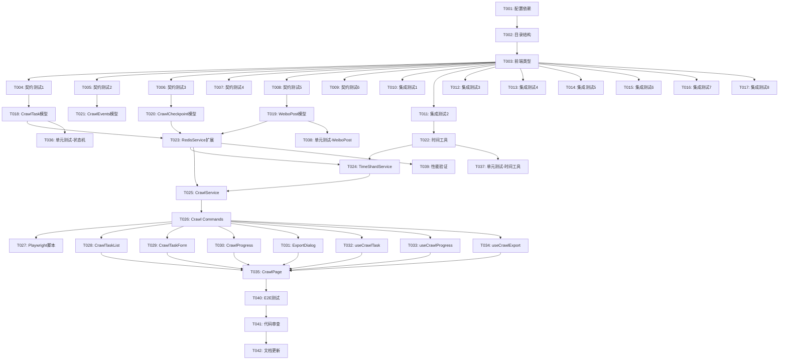

# Tasks: 微博关键字增量爬取

**Feature**: 003- | **Generated**: 2025-10-07
**Input Documents**:
- spec.md (功能规格)
- plan.md (实施计划)
- research.md (技术方案研究)
- data-model.md (数据模型设计)
- quickstart.md (端到端测试场景)
- contracts/ (6个Tauri命令契约)

---

## Execution Flow

本tasks.md遵循TDD原则,执行顺序如下:

```
Phase 3.1: Setup (项目初始化,配置环境)
    ↓
Phase 3.2: Tests First (先写测试,TDD红色阶段)
    ├─ 契约测试 [P] (6个并行)
    └─ 集成测试 [P] (8个并行)
    ↓
Phase 3.3: Core Implementation (核心实现,TDD绿色阶段)
    ├─ L0: [P] Models (4个并行)
    ├─ L1: Time Utils
    ├─ L2: Redis Service扩展
    ├─ L3: [P] Time Shard Service, Crawl Service (2个并行)
    ├─ L4: Crawl Commands
    └─ L5: Playwright脚本
    ↓
Phase 3.4: Frontend (前端UI)
    ├─ L6: [P] 组件 (4个并行)
    ├─ L7: [P] Hooks (3个并行)
    └─ L8: 页面
    ↓
Phase 3.5: Polish (优化和单元测试)
    ├─ 单元测试
    ├─ 性能验证
    └─ 文档更新
```

**关键原则**:
1. ✅ 测试先于实现 (TDD)
2. ✅ 每个任务完成后提交代码
3. ✅ 并行任务标记 [P]
4. ✅ 依赖任务按层级执行

---

## Phase 3.1: Setup

### T001: 配置Rust依赖

**文件**: `/home/ubuntu/worktrees/desktop/src-tauri/Cargo.toml`

**任务**:
- 添加依赖: `uuid`, `chrono`, `rand`
- 验证依赖已存在: `tokio`, `serde`, `redis`, `deadpool-redis`, `tracing`

**完成标准**:
- [ ] Cargo.toml包含所有必需依赖
- [ ] `cargo build`成功

---

### T002: 创建模块目录结构

**文件**: `/home/ubuntu/worktrees/desktop/src-tauri/src/`

**任务**:
- 在`models/mod.rs`中导出新模块
- 在`services/mod.rs`中导出新模块
- 在`commands/mod.rs`中导出新模块
- 在`utils/mod.rs`中添加time_utils导出

**完成标准**:
- [ ] 模块结构正确
- [ ] 编译无错误

---

### T003: 创建前端类型定义文件

**文件**: `/home/ubuntu/worktrees/desktop/src/types/crawl.ts`

**任务**:
- 定义TypeScript接口 (对应后端模型):
  - CrawlTask
  - WeiboPost
  - CrawlCheckpoint
  - CrawlProgressEvent
  - CrawlCompletedEvent
  - CrawlErrorEvent

**完成标准**:
- [ ] 所有接口与data-model.md一致
- [ ] TypeScript编译无错误

---

## Phase 3.2: Tests First (TDD - 先写测试)

### 契约测试 (6个并行)

---

### T004: [P] 契约测试 - create_crawl_task

**文件**: `/home/ubuntu/worktrees/desktop/tests/contract/test_create_crawl_task.rs`

**任务**:
根据`contracts/create_crawl_task.md`编写测试:
- 参数验证: keyword为空返回INVALID_KEYWORD
- 参数验证: eventStartTime是未来时间返回INVALID_TIME
- Cookies检查: uid不存在返回COOKIES_NOT_FOUND
- Cookies检查: cookies年龄>7天返回COOKIES_EXPIRED
- 成功创建: 返回有效UUID,任务保存到Redis

**完成标准**:
- [ ] 测试编译通过
- [ ] 测试运行失败 (红色阶段,实现尚未完成)

---

### T005: [P] 契约测试 - start_crawl

**文件**: `/home/ubuntu/worktrees/desktop/tests/contract/test_start_crawl.rs`

**任务**:
根据`contracts/start_crawl.md`编写测试:
- 任务不存在返回TASK_NOT_FOUND
- Created状态可启动,状态转换到HistoryCrawling
- Paused状态可恢复,从检查点继续
- HistoryCompleted状态可启动增量,转换到IncrementalCrawling
- Failed状态无法启动,返回INVALID_STATUS
- 已有任务运行时返回ALREADY_RUNNING

**完成标准**:
- [ ] 测试编译通过
- [ ] 测试运行失败 (红色阶段)

---

### T006: [P] 契约测试 - pause_crawl

**文件**: `/home/ubuntu/worktrees/desktop/tests/contract/test_pause_crawl.rs`

**任务**:
根据`contracts/pause_crawl.md`编写测试:
- 任务不存在返回TASK_NOT_FOUND
- HistoryCrawling状态可暂停
- IncrementalCrawling状态可暂停
- Created状态无法暂停,返回INVALID_STATUS
- 暂停时保存检查点到Redis

**完成标准**:
- [ ] 测试编译通过
- [ ] 测试运行失败 (红色阶段)

---

### T007: [P] 契约测试 - get_crawl_progress

**文件**: `/home/ubuntu/worktrees/desktop/tests/contract/test_get_crawl_progress.rs`

**任务**:
根据`contracts/get_crawl_progress.md`编写测试:
- 任务不存在返回TASK_NOT_FOUND
- 成功返回任务进度信息
- 运行中或暂停的任务包含检查点
- Created状态的任务checkpoint为null
- 进度百分比计算正确

**完成标准**:
- [ ] 测试编译通过
- [ ] 测试运行失败 (红色阶段)

---

### T008: [P] 契约测试 - export_crawl_data

**文件**: `/home/ubuntu/worktrees/desktop/tests/contract/test_export_crawl_data.rs`

**任务**:
根据`contracts/export_crawl_data.md`编写测试:
- 任务不存在返回TASK_NOT_FOUND
- 无数据时返回NO_DATA
- 支持json格式导出
- 支持csv格式导出
- 不支持的格式返回INVALID_FORMAT
- 时间范围过滤生效

**完成标准**:
- [ ] 测试编译通过
- [ ] 测试运行失败 (红色阶段)

---

### T009: [P] 契约测试 - list_crawl_tasks

**文件**: `/home/ubuntu/worktrees/desktop/tests/contract/test_list_crawl_tasks.rs`

**任务**:
根据`contracts/list_crawl_tasks.md`编写测试:
- 无任务时返回空数组
- 返回所有任务摘要信息
- 按状态过滤正确
- 按创建时间排序正确
- 所有时间字段使用ISO 8601格式

**完成标准**:
- [ ] 测试编译通过
- [ ] 测试运行失败 (红色阶段)

---

### 集成测试 (8个并行,对应quickstart.md的8个场景)

---

### T010: [P] 集成测试 - 场景1: 创建爬取任务

**文件**: `/home/ubuntu/worktrees/desktop/tests/integration/test_scenario_1_create_task.rs`

**任务**:
根据`quickstart.md场景1`编写测试:
- 创建任务成功,返回task_id
- 任务状态为Created
- Redis中存在任务记录
- 边界测试: 关键字为空、事件时间是未来、cookies过期

**完成标准**:
- [ ] 测试编译通过
- [ ] 测试运行失败 (红色阶段)

---

### T011: [P] 集成测试 - 场景2: 启动历史回溯

**文件**: `/home/ubuntu/worktrees/desktop/tests/integration/test_scenario_2_start_crawl.rs`

**任务**:
根据`quickstart.md场景2`编写测试:
- 任务状态转换: Created → HistoryCrawling
- 每页爬取后推送crawl-progress事件
- Redis检查点保存正确
- Redis帖子数据存在
- 帖子ID去重生效

**完成标准**:
- [ ] 测试编译通过
- [ ] 测试运行失败 (红色阶段)

---

### T012: [P] 集成测试 - 场景3: 暂停并恢复任务

**文件**: `/home/ubuntu/worktrees/desktop/tests/integration/test_scenario_3_pause_resume.rs`

**任务**:
根据`quickstart.md场景3`编写测试:
- 暂停后状态转换到Paused
- 检查点保存当前页码
- 恢复后从下一页继续
- 无重复数据

**完成标准**:
- [ ] 测试编译通过
- [ ] 测试运行失败 (红色阶段)

---

### T013: [P] 集成测试 - 场景4: 完成历史回溯

**文件**: `/home/ubuntu/worktrees/desktop/tests/integration/test_scenario_4_history_completed.rs`

**任务**:
根据`quickstart.md场景4`编写测试:
- 状态转换: HistoryCrawling → HistoryCompleted
- 推送crawl-completed事件
- min_post_time接近event_start_time
- 帖子时间范围正确

**完成标准**:
- [ ] 测试编译通过
- [ ] 测试运行失败 (红色阶段)

---

### T014: [P] 集成测试 - 场景5: 增量更新

**文件**: `/home/ubuntu/worktrees/desktop/tests/integration/test_scenario_5_incremental.rs`

**任务**:
根据`quickstart.md场景5`编写测试:
- 状态转换: HistoryCompleted → IncrementalCrawling
- 爬取方向为Forward
- 仅爬取max_post_time之后的帖子

**完成标准**:
- [ ] 测试编译通过
- [ ] 测试运行失败 (红色阶段)

---

### T015: [P] 集成测试 - 场景6: 导出数据

**文件**: `/home/ubuntu/worktrees/desktop/tests/integration/test_scenario_6_export.rs`

**任务**:
根据`quickstart.md场景6`编写测试:
- JSON格式导出正确
- CSV格式导出正确
- 时间范围过滤生效
- 文件保存到下载目录

**完成标准**:
- [ ] 测试编译通过
- [ ] 测试运行失败 (红色阶段)

---

### T016: [P] 集成测试 - 场景7: 异常处理

**文件**: `/home/ubuntu/worktrees/desktop/tests/integration/test_scenario_7_error_handling.rs`

**任务**:
根据`quickstart.md场景7`编写测试:
- 验证码检测自动暂停
- 网络错误后进入Failed状态
- Redis连接失败返回STORAGE_ERROR

**完成标准**:
- [ ] 测试编译通过
- [ ] 测试运行失败 (红色阶段)

---

### T017: [P] 集成测试 - 场景8: 性能验证

**文件**: `/home/ubuntu/worktrees/desktop/tests/integration/test_scenario_8_performance.rs`

**任务**:
根据`quickstart.md性能验证`编写测试:
- 支持百万级帖子存储
- 帖子查询按时间范围 <100ms
- 断点续爬精确性验证

**完成标准**:
- [ ] 测试编译通过
- [ ] 测试运行失败 (红色阶段)

---

## Phase 3.3: Core Implementation (核心实现 - TDD绿色阶段)

### L0: Models (4个并行)

---

### T018: [P] 实现CrawlTask模型

**文件**: `/home/ubuntu/worktrees/desktop/src-tauri/src/models/crawl_task.rs`

**任务**:
根据`data-model.md`实现:
- CrawlTask结构 (所有字段)
- CrawlStatus枚举 (6种状态)
- `new()` 构造函数
- `update_progress()` 更新进度
- `transition_to()` 状态转换验证
- `mark_failed()` 标记失败
- `validate()` 数据验证
- `redis_key()` Redis键生成

**完成标准**:
- [ ] 所有方法实现完成
- [ ] 状态转换逻辑正确
- [ ] 通过T004部分测试

**依赖**: 无

---

### T019: [P] 实现WeiboPost模型

**文件**: `/home/ubuntu/worktrees/desktop/src-tauri/src/models/weibo_post.rs`

**任务**:
根据`data-model.md`实现:
- WeiboPost结构 (所有字段)
- `new()` 构造函数
- `to_json()` 序列化
- `from_json()` 反序列化
- `validate()` 数据验证

**完成标准**:
- [ ] 所有方法实现完成
- [ ] JSON序列化/反序列化正确
- [ ] 通过T008部分测试

**依赖**: 无

---

### T020: [P] 实现CrawlCheckpoint模型

**文件**: `/home/ubuntu/worktrees/desktop/src-tauri/src/models/crawl_checkpoint.rs`

**任务**:
根据`data-model.md`实现:
- CrawlCheckpoint结构
- CrawlDirection枚举 (Backward/Forward)
- `new_backward()` 历史回溯检查点
- `new_forward()` 增量更新检查点
- `advance_page()` 推进到下一页
- `complete_current_shard()` 完成当前分片
- `redis_key()` Redis键生成

**完成标准**:
- [ ] 所有方法实现完成
- [ ] 检查点逻辑正确
- [ ] 通过T006部分测试

**依赖**: 无

---

### T021: [P] 实现CrawlEvents模型

**文件**: `/home/ubuntu/worktrees/desktop/src-tauri/src/models/crawl_events.rs`

**任务**:
根据`data-model.md`和`contracts/start_crawl.md`实现:
- CrawlProgressEvent结构
- CrawlCompletedEvent结构
- CrawlErrorEvent结构
- 所有事件的序列化支持

**完成标准**:
- [ ] 所有事件结构定义完成
- [ ] 通过T005部分测试

**依赖**: 无

---

### L1: Utilities

---

### T022: 实现时间工具函数

**文件**: `/home/ubuntu/worktrees/desktop/src-tauri/src/utils/time_utils.rs`

**任务**:
根据`research.md第3节`实现:
- `floor_to_hour(dt: DateTime<Utc>) -> DateTime<Utc>`: 向下取整到小时
- `ceil_to_hour(dt: DateTime<Utc>) -> DateTime<Utc>`: 向上取整到小时
- `parse_weibo_time(s: &str) -> Result<DateTime<Utc>>`: 解析微博时间格式
- `format_weibo_time(dt: DateTime<Utc>) -> String`: 格式化为微博API时间参数 (YYYYMMDDhhmmss)

**完成标准**:
- [ ] 所有函数实现完成
- [ ] 边界情况处理正确
- [ ] 编写单元测试验证

**依赖**: 无

---

### L2: Redis Service扩展

---

### T023: 扩展RedisService爬取任务存储方法

**文件**: `/home/ubuntu/worktrees/desktop/src-tauri/src/services/redis_service.rs`

**任务**:
扩展已有RedisService,添加以下方法:
- `save_crawl_task(&self, task: &CrawlTask) -> Result<()>`: 保存任务
- `load_task(&self, task_id: &str) -> Result<CrawlTask>`: 加载任务
- `list_all_tasks(&self) -> Result<Vec<CrawlTask>>`: 列出所有任务
- `save_checkpoint(&self, checkpoint: &CrawlCheckpoint) -> Result<()>`: 保存检查点
- `load_checkpoint(&self, task_id: &str) -> Result<Option<CrawlCheckpoint>>`: 加载检查点
- `save_posts(&self, task_id: &str, posts: &[WeiboPost]) -> Result<()>`: 批量保存帖子 (ZADD)
- `get_posts_by_time_range(&self, task_id: &str, start: DateTime<Utc>, end: DateTime<Utc>) -> Result<Vec<WeiboPost>>`: 按时间范围查询帖子 (ZRANGEBYSCORE)
- `check_post_exists(&self, task_id: &str, post_id: &str) -> Result<bool>`: 检查帖子是否已存在 (SISMEMBER)

**完成标准**:
- [ ] 所有方法实现完成
- [ ] Redis命令使用正确
- [ ] 通过T004-T009部分测试

**依赖**: T018-T020 (依赖CrawlTask, WeiboPost, CrawlCheckpoint模型)

---

### L3: Core Services (2个并行)

---

### T024: [P] 实现TimeShardService

**文件**: `/home/ubuntu/worktrees/desktop/src-tauri/src/services/time_shard_service.rs`

**任务**:
根据`research.md第3节`实现:
- `TimeShardService`结构
- `split_time_range_if_needed()`: 递归二分时间范围算法
  - 输入: 时间范围 [start, end], keyword
  - 输出: Vec<(DateTime<Utc>, DateTime<Utc>)> 子时间范围列表
  - 规则: 如果结果数>1000,二分时间范围;最小粒度1小时
- `estimate_total_results()`: 估算时间范围内结果数 (通过爬取第一页)

**完成标准**:
- [ ] 算法实现正确
- [ ] 递归终止条件处理
- [ ] 编写单元测试验证
- [ ] 通过T011部分测试

**依赖**: T022 (依赖time_utils), T023 (依赖RedisService)

---

### T025: [P] 实现CrawlService

**文件**: `/home/ubuntu/worktrees/desktop/src-tauri/src/services/crawl_service.rs`

**任务**:
根据`plan.md`和`research.md`实现:
- `CrawlService`结构 (包含RedisService, TimeShardService引用)
- `start_history_crawl(&self, task_id: &str) -> Result<()>`: 启动历史回溯
  - 从现在到event_start_time
  - 使用TimeShardService拆分时间范围
  - 每页爬取后保存检查点
  - 推送crawl-progress事件
- `start_incremental_crawl(&self, task_id: &str) -> Result<()>`: 启动增量更新
  - 从max_post_time到现在
  - 推送crawl-progress事件
- `resume_crawl(&self, task_id: &str) -> Result<()>`: 从检查点恢复
  - 加载检查点
  - 根据方向继续爬取
- `cancel_crawl(&self, task_id: &str) -> Result<()>`: 取消爬取
  - 使用CancellationToken停止后台任务
- `crawl_page()`: 爬取单页 (调用Playwright脚本)
  - 随机延迟1-3秒
  - 重试3次 (指数退避)
  - 验证码检测

**完成标准**:
- [ ] 所有方法实现完成
- [ ] 后台任务管理正确 (tokio::spawn)
- [ ] 事件推送正确
- [ ] 通过T005, T011-T014测试

**依赖**: T023 (依赖RedisService), T024 (依赖TimeShardService)

---

### L4: Commands

---

### T026: 实现Tauri Commands

**文件**: `/home/ubuntu/worktrees/desktop/src-tauri/src/commands/crawl_commands.rs`

**任务**:
根据`contracts/`实现6个Tauri commands:
- `create_crawl_task(keyword, event_start_time, uid) -> Result<String>`: 创建任务
- `start_crawl(task_id) -> Result<String>`: 启动爬取
- `pause_crawl(task_id) -> Result<()>`: 暂停爬取
- `get_crawl_progress(task_id) -> Result<CrawlProgress>`: 查询进度
- `export_crawl_data(task_id, format, time_range) -> Result<String>`: 导出数据
- `list_crawl_tasks(status, sort_by, sort_order) -> Result<Vec<CrawlTaskSummary>>`: 列出任务

**完成标准**:
- [ ] 所有commands实现完成
- [ ] 错误处理完整 (符合契约错误码)
- [ ] 在main.rs中注册commands
- [ ] 通过T004-T009所有契约测试

**依赖**: T025 (依赖CrawlService)

---

### L5: Playwright脚本

---

### T027: 实现微博爬取Playwright脚本

**文件**: `/home/ubuntu/worktrees/desktop/playwright/src/weibo-crawler.ts`

**任务**:
根据`research.md第5节`实现:
- `crawlWeiboSearch(request: CrawlRequest): Promise<CrawlResult>`: 爬取搜索结果
  - 设置cookies
  - 构建搜索URL (包含时间范围参数)
  - 检测验证码
  - 提取帖子数据 (id, text, created_at, author信息, 互动数据)
  - 返回hasMore标识
- `buildSearchUrl()`: 构建微博搜索API URL
- WebSocket通信协议处理 (复用已有server架构)
  - 监听"crawl_weibo_search" action
  - 返回posts数组和hasMore

**完成标准**:
- [ ] 脚本实现完成
- [ ] 验证码检测正确
- [ ] 与Rust后端通信正常
- [ ] 通过T011测试

**依赖**: T026 (依赖commands调用)

---

## Phase 3.4: Frontend (前端UI)

### L6: Components (4个并行)

---

### T028: [P] 实现CrawlTaskList组件

**文件**: `/home/ubuntu/worktrees/desktop/src/components/CrawlTaskList.tsx`

**任务**:
- 展示任务列表 (调用list_crawl_tasks)
- 显示任务状态徽章
- 支持按状态过滤
- 点击任务查看详情

**完成标准**:
- [ ] 组件渲染正确
- [ ] 状态过滤生效
- [ ] TypeScript类型正确

**依赖**: T003 (依赖前端类型定义), T026 (依赖commands)

---

### T029: [P] 实现CrawlTaskForm组件

**文件**: `/home/ubuntu/worktrees/desktop/src/components/CrawlTaskForm.tsx`

**任务**:
- 新建任务表单
- 输入: 关键字、事件开始时间、选择账号 (调用list_all_uids)
- 表单验证
- 调用create_crawl_task

**完成标准**:
- [ ] 表单验证正确
- [ ] 创建任务成功
- [ ] 错误提示清晰

**依赖**: T003, T026

---

### T030: [P] 实现CrawlProgress组件

**文件**: `/home/ubuntu/worktrees/desktop/src/components/CrawlProgress.tsx`

**任务**:
- 实时进度展示 (进度条、统计信息)
- 监听crawl-progress事件 (Tauri事件监听)
- 显示当前时间范围、页码、已爬取数量
- 显示检查点信息

**完成标准**:
- [ ] 实时更新正确
- [ ] 进度条准确
- [ ] 事件监听正常

**依赖**: T003, T026

---

### T031: [P] 实现ExportDialog组件

**文件**: `/home/ubuntu/worktrees/desktop/src/components/ExportDialog.tsx`

**任务**:
- 导出对话框
- 选择格式 (JSON/CSV)
- 可选时间范围过滤
- 调用export_crawl_data
- 显示导出成功消息和文件路径

**完成标准**:
- [ ] 格式选择正确
- [ ] 时间范围过滤生效
- [ ] 导出成功提示

**依赖**: T003, T026

---

### L7: Hooks (3个并行)

---

### T032: [P] 实现useCrawlTask Hook

**文件**: `/home/ubuntu/worktrees/desktop/src/hooks/useCrawlTask.ts`

**任务**:
- 封装任务CRUD操作:
  - `createTask()`: 创建任务
  - `startTask()`: 启动任务
  - `pauseTask()`: 暂停任务
  - `listTasks()`: 列出任务
- 状态管理 (tasks列表)
- 错误处理

**完成标准**:
- [ ] Hook实现完成
- [ ] 状态管理正确
- [ ] 错误处理完整

**依赖**: T026

---

### T033: [P] 实现useCrawlProgress Hook

**文件**: `/home/ubuntu/worktrees/desktop/src/hooks/useCrawlProgress.ts`

**任务**:
- 监听Tauri事件:
  - crawl-progress
  - crawl-completed
  - crawl-error
- 状态管理 (progress对象)
- 清理事件监听器

**完成标准**:
- [ ] 事件监听正确
- [ ] 状态实时更新
- [ ] 组件卸载时清理

**依赖**: T026

---

### T034: [P] 实现useCrawlExport Hook

**文件**: `/home/ubuntu/worktrees/desktop/src/hooks/useCrawlExport.ts`

**任务**:
- 封装导出操作
- `exportData(taskId, format, timeRange)`: 导出数据
- 状态管理 (loading, error)

**完成标准**:
- [ ] Hook实现完成
- [ ] 导出成功处理
- [ ] 错误处理完整

**依赖**: T026

---

### L8: Page

---

### T035: 实现CrawlPage页面

**文件**: `/home/ubuntu/worktrees/desktop/src/pages/CrawlPage.tsx`

**任务**:
- 整合所有组件:
  - CrawlTaskList
  - CrawlTaskForm
  - CrawlProgress
  - ExportDialog
- 页面布局 (TailwindCSS)
- 路由配置

**完成标准**:
- [ ] 页面渲染正确
- [ ] 所有功能可用
- [ ] UI美观一致

**依赖**: T028-T034 (依赖所有组件和Hooks)

---

## Phase 3.5: Polish (优化和完善)

### T036: 编写单元测试 - CrawlTask状态机

**文件**: `/home/ubuntu/worktrees/desktop/tests/unit/test_crawl_task_model.rs`

**任务**:
- 测试所有状态转换
- 测试验证规则
- 测试边界情况

**完成标准**:
- [ ] 覆盖所有状态转换路径
- [ ] 测试通过

**依赖**: T018

---

### T037: 编写单元测试 - 时间工具函数

**文件**: `/home/ubuntu/worktrees/desktop/tests/unit/test_time_utils.rs`

**任务**:
- 测试floor_to_hour
- 测试ceil_to_hour
- 测试parse_weibo_time
- 测试边界情况

**完成标准**:
- [ ] 覆盖所有函数
- [ ] 测试通过

**依赖**: T022

---

### T038: 编写单元测试 - WeiboPost验证

**文件**: `/home/ubuntu/worktrees/desktop/tests/unit/test_weibo_post_validation.rs`

**任务**:
- 测试validate()方法
- 测试JSON序列化/反序列化
- 测试边界情况

**完成标准**:
- [ ] 覆盖所有验证规则
- [ ] 测试通过

**依赖**: T019

---

### T039: 性能优化验证

**文件**: 无 (性能测试)

**任务**:
- 验证百万级帖子存储
- 验证时间范围查询性能 (<100ms)
- 验证导出性能 (100万条 <30秒)
- 优化Redis批量操作

**完成标准**:
- [ ] 性能指标达标
- [ ] 无内存泄漏

**依赖**: T023

---

### T040: 端到端测试验证

**文件**: 无 (执行quickstart.md)

**任务**:
- 按照quickstart.md执行所有8个场景
- 验证所有边界测试
- 验证性能要求
- 记录测试结果

**完成标准**:
- [ ] 所有场景通过
- [ ] 所有边界测试通过
- [ ] 性能验证达标

**依赖**: T035 (所有功能实现完成)

---

### T041: 代码审查和重构

**文件**: 全部

**任务**:
- 遵循宪章原则审查代码:
  - 存在即合理: 删除冗余代码
  - 优雅即简约: 优化命名和结构
  - 性能即艺术: 算法复杂度检查
  - 错误处理: 完整性检查
  - 日志表达: 结构化日志验证
- 运行cargo clippy
- 运行cargo fmt

**完成标准**:
- [ ] 无clippy警告
- [ ] 代码格式一致
- [ ] 符合宪章原则

**依赖**: T040

---

### T042: 文档更新

**文件**: `/home/ubuntu/worktrees/desktop/specs/003-/`

**任务**:
- 更新spec.md (标记为Implemented)
- 更新plan.md (记录实施结果)
- 创建CHANGELOG.md (记录变更)
- 更新README.md (添加使用说明)

**完成标准**:
- [ ] 所有文档更新完成
- [ ] 使用说明清晰

**依赖**: T041

---

## Dependencies (依赖关系图)



---

## Parallel Execution Example (并行执行示例)

假设有4个agents并行执行任务:

### Round 1: Phase 3.2 Tests First
- Agent 1: T004, T005 (契约测试1-2)
- Agent 2: T006, T007 (契约测试3-4)
- Agent 3: T008, T009 (契约测试5-6)
- Agent 4: T010, T011 (集成测试1-2)

### Round 2: Phase 3.2 Tests (继续)
- Agent 1: T012 (集成测试3)
- Agent 2: T013 (集成测试4)
- Agent 3: T014 (集成测试5)
- Agent 4: T015 (集成测试6)

### Round 3: Phase 3.2 Tests (完成)
- Agent 1: T016 (集成测试7)
- Agent 2: T017 (集成测试8)
- Agent 3, 4: 等待

### Round 4: Phase 3.3 L0 Models
- Agent 1: T018 (CrawlTask模型)
- Agent 2: T019 (WeiboPost模型)
- Agent 3: T020 (CrawlCheckpoint模型)
- Agent 4: T021 (CrawlEvents模型)

### Round 5: Phase 3.3 L1-L2
- Agent 1: T022 (时间工具)
- Agent 2-4: 等待
- Agent 1完成后: T023 (RedisService扩展)

### Round 6: Phase 3.3 L3 Core Services
- Agent 1: T024 (TimeShardService)
- Agent 2: T025 (CrawlService)
- Agent 3, 4: 等待

### Round 7: Phase 3.3 L4-L5
- Agent 1: T026 (Commands)
- Agent 2-4: 等待
- Agent 1完成后: T027 (Playwright)

### Round 8: Phase 3.4 L6 Components
- Agent 1: T028 (CrawlTaskList)
- Agent 2: T029 (CrawlTaskForm)
- Agent 3: T030 (CrawlProgress)
- Agent 4: T031 (ExportDialog)

### Round 9: Phase 3.4 L7 Hooks
- Agent 1: T032 (useCrawlTask)
- Agent 2: T033 (useCrawlProgress)
- Agent 3: T034 (useCrawlExport)
- Agent 4: 等待

### Round 10: Phase 3.4 L8 Page
- Agent 1: T035 (CrawlPage)
- Agent 2-4: 等待

### Round 11: Phase 3.5 Polish
- Agent 1: T036 (单元测试-状态机)
- Agent 2: T037 (单元测试-时间工具)
- Agent 3: T038 (单元测试-WeiboPost)
- Agent 4: T039 (性能验证)

### Round 12: Phase 3.5 Final
- Agent 1: T040 (E2E测试)
- Agent 1完成后: T041 (代码审查)
- Agent 1完成后: T042 (文档更新)

**预估时长**:
- 单agent顺序执行: ~30小时
- 4个agents并行执行: ~12小时 (并行效率约60%)

---

## Notes

### TDD提醒
1. **红色阶段**: Phase 3.2所有测试应该失败 (实现尚未完成)
2. **绿色阶段**: Phase 3.3实现代码,逐步通过测试
3. **重构阶段**: Phase 3.5优化代码,保持测试通过

### 提交策略
每个任务完成后立即提交:
```bash
git add .
git commit -m "feat(003): 完成T001 - 配置Rust依赖"
```

### 并行任务规则
- 标记 [P] 的任务可由不同agents并行执行
- 同一文件的任务不能并行 (避免冲突)
- 有依赖关系的任务不能并行

### 复用策略
- 复用RedisService (扩展方法,不修改已有接口)
- 复用query_cookies (从001-cookies获取登录态)
- 复用Playwright server架构 (添加新脚本)

### 关键验证点
- [ ] 所有契约测试通过 (T004-T009)
- [ ] 所有集成测试通过 (T010-T017)
- [ ] 端到端测试通过 (T040)
- [ ] 性能指标达标 (T039)
- [ ] 符合宪章原则 (T041)

---

**总任务数**: 42个任务
**可并行任务数**: 24个任务 (标记 [P])
**预估总时长**:
- 单agent: ~30小时
- 4个agents并行: ~12小时

**生成时间**: 2025-10-07
**状态**: Ready for implementation
